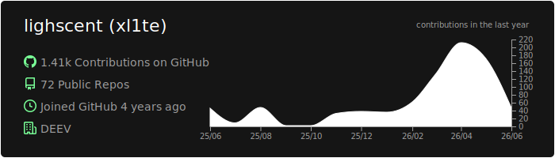
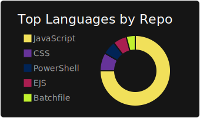
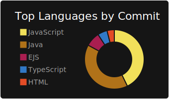
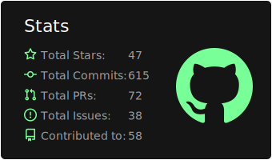



  

  <h1>🚀 Développeur Backend & Architecte Systèmes</h1>

  

    
    
    
  

  ---

  

    <strong>Passionné par la conception d'infrastructures robustes et la sécurisation des flux de données.</strong> 
    <i>"Transformer des idées complexes en APIs performantes et scalables."</i>
  

## 👤 À Propos de Moi

<table align="center">
  <tr>
    <td width="50%" valign="top">
      <h3>🎯 Objectifs 2025</h3>
      <ul>
        <li>🏗️ <b>Webchat Fullstack :</b> Déploiement et maintenance d'une solution de messagerie temps-réel.</li>
        <li>🔐 <b>Security Expert :</b> Approfondissement des protocoles d'authentification avancés (OAuth2, OpenID Connect).</li>
        <li>☁️ <b>Cloud Native :</b> Optimisation des déploiements via Docker et orchestration AWS.</li>
      </ul>
    </td>
    <td width="50%" valign="top">
      <h3>📊 GitHub Trophies</h3>
      
    </td>
  </tr>
</table>

---

## 🛠️ Stack Technique & Écosystème

### 💻 Langages & Core

### ⚙️ Backend & Bases de Données

### ☁️ DevOps & Infrastructure

---

## 📊 Analyse d'Activité

  
  

  
  

---

## 📫 Me Contacter & Réseaux

  

---

  ⭐️ <i>"Le code est comme l'humour. Quand on doit l'expliquer, c'est qu'il est mauvais."</i>

