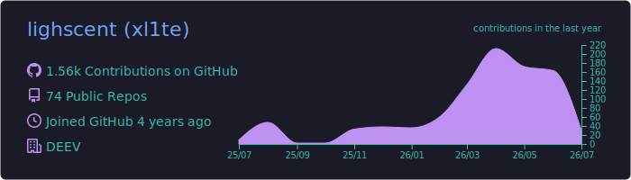
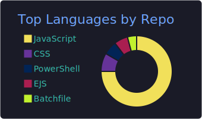
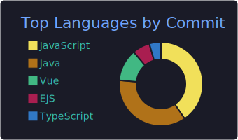



  

  <h1>🚀 Développeur Backend & Architecte Systèmes</h1>

  

    
    
    
  

---

## 👤 Profil & Expertise

<table align="center">
  <tr>
    <td width="50%" valign="top">
      <h3>🎯 Objectifs 2025</h3>
      <ul>
        <li>🏗️ <b>Webchat Fullstack :</b> Solution temps-réel scalable.</li>
        <li>🔐 <b>Security Expert :</b> OAuth2 & OpenID Connect.</li>
        <li>☁️ <b>Cloud Native :</b> Orchestration Docker/AWS.</li>
      </ul>
       
      
    </td>
    <td width="50%" valign="top">
      <h3>📊 Vue d'ensemble</h3>
      
    </td>
  </tr>
</table>

---

## 📂 Projets Vedettes (Open Source)

  
  

---

## 🌐 Déploiements & Sites Live
| Projet | Status | Stack | Lien |
| :--- | :---: | :--- | :--- |
| **Webchat App** |  | Node/Express/Socket.io | [Accéder ↗️](https://ton-site.com) |
| **Portfolio** |  | EJS/Docker | [Accéder ↗️](https://lighscent.dev) |

---

## 🛠️ Stack Technique

<b>💻 Langages & Core (Clique pour voir)</b>

 

  
  
  

<b>⚙️ Backend & Infrastructure (Clique pour voir)</b>

 

  
  
  
  

---

## 📈 Analyse de Code

  
  

---

  
   
  

